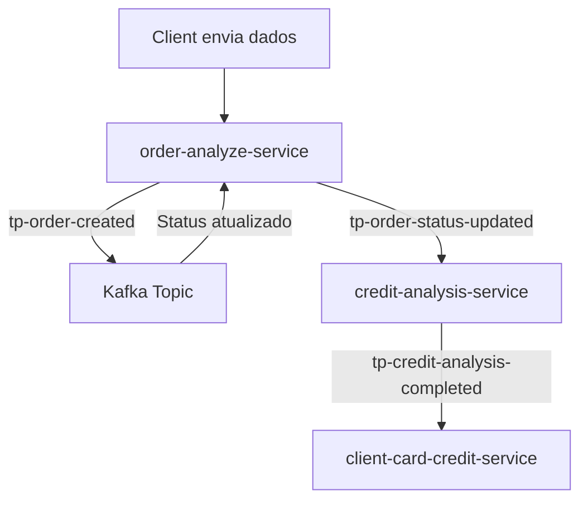

# MVP - CrediFlow 

**CrediFlow** é um sistema de análise e concessão de crédito baseado em arquitetura de microsserviços, com comunicação assíncrona via Kafka, banco de dados orientado a documentos e relacional, respeitando os princípios de design SOLID.

---

##  Objetivo do Projeto

Criar uma solução escalável, robusta e desacoplada para processar pedidos de crédito de forma eficiente e modular, utilizando tecnologias modernas e melhores práticas de arquitetura de software.

---

## Tecnologias Utilizadas

- **Java 17**
- **Spring Boot 3**
- **Apache Kafka**
- **MongoDB** (para armazenar análises e pedidos)
- **PostgreSQL** (para armazenar dados finais do cliente e cartão)
- **Lombok**
- **Docker** (opcional para ambiente local)
- **Maven**

---

## Estrutura de Microsserviços

### 1. **order-analyze-service**

-  **Responsabilidade:** Receber os dados iniciais do cliente e gerar uma `Order`.
- ️ **Banco de dados:** MongoDB
-  **Publica no tópico:** `tp-order-created`
-  **Escuta o tópico:** `order-status-updated`

---

### 2. **credit-analysis-service**

-  **Responsabilidade:** Realizar a análise de crédito, considerando score, limite e pendências financeiras.
-  **Lógica:** Avalia se o crédito pode ser aprovado. Se sim, envia a análise para o próximo microserviço.
- ️ **Banco de dados:** MongoDB
-  **Escuta o tópico:** `order-status-updated`
-  **Publica no tópico:** `credit-analysis-completed`
  -   **Job de Retry:** verifica análises pendentes e reprocessa automaticamente (caso o serviço fique offline).

---

### 3. **client-card-credit-service**

- **Responsabilidade:** Receber os dados da análise de crédito e gerar o cartão de crédito para o cliente.
- **Banco de dados:** PostgreSQL
- **Escuta o tópico:** `credit-analysis-completed`

---

## Fluxo das Mensagerias (Kafka)

---
## Princípios SOLID Aplicados

S – Single Responsibility: Cada microserviço tem uma responsabilidade única bem definida.

O – Open/Closed: Os componentes são extensíveis sem alterar sua implementação original.

L – Liskov Substitution: As abstrações podem ser substituídas pelas implementações sem quebrar o comportamento.

I – Interface Segregation: Separação de contratos conforme necessidades específicas.

D – Dependency Inversion: As dependências são injetadas, promovendo baixo acoplamento e alta coesão.

---

## Futuras Melhorias

- Integração com serviços externos de score real.

- Autenticação e Autorização com Spring Security e JWT.

- Dashboard de controle com consumo via Kafka.

- Testes automatizados com JUnit e Testcontainers.

---

## Criado por

**Filipe Santana Cordeiro**  
**Backend Developer**

